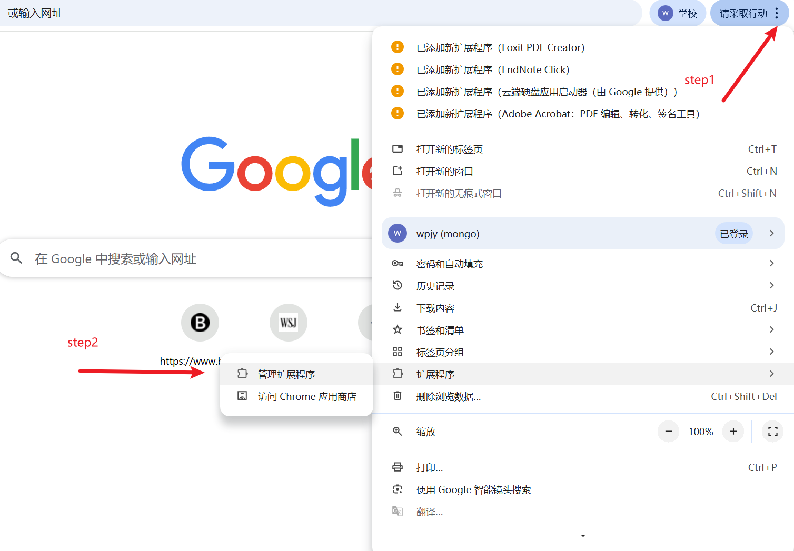
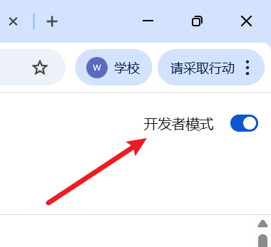

# SSRN Quick Jump

一个 Chrome 浏览器扩展，在学术期刊网站的文章标题旁自动添加 SSRN 链接，方便快速跳转到 SSRN 查看工作论文版本。

## 解决的痛点

经济学、金融学、会计学等领域的顶级期刊（如 AER、JF、TAR 等）大多需要付费订阅才能阅读。然而，很多高校（比如你鸭）由于预算限制，并未购买这些期刊的访问权限，这给学术研究带来了极大的不便。

好消息是，大多数发表在顶刊上的论文，在正式发表前都会以工作论文（Working Paper）的形式上传到 SSRN（Social Science Research Network）平台，而 SSRN 上的论文通常可以免费下载。

**本插件的作用**：在浏览顶刊网站时，自动在文章标题旁添加 SSRN 链接，一键跳转到 SSRN 平台查找并下载该论文的免费版本，让没有期刊访问权限的研究者也能顺利获取所需文献。

## 安装方式

### 步骤 1：打开 Chrome 扩展程序管理页面

在 Chrome 浏览器中，点击右上角的"三个点"菜单，选择"扩展程序" → "管理扩展程序"，或直接访问 `chrome://extensions/`



### 步骤 2：开启开发者模式


在扩展程序管理页面，打开右上角的"开发者模式"开关


### 步骤 3：加载未打包的扩展程序

点击页面左上角的"加载已解压的扩展程序"按钮（需要先开启右上角的"开发者模式"）


### 步骤 4：选择插件文件夹

从 GitHub 下载项目压缩包后，解压缩。**注意**：从 GitHub 下载的 zip 文件解压后，会有双层文件夹结构。

第一次点击"加载已解压的扩展程序"，选择解压后的文件夹（如 `ssrn-quick-jump-main`），会提示"清单文件缺失或不可读取"。

**这时需要再次点击"加载已解压的扩展程序"**，进入刚才的文件夹内部，选择里面真正包含以下文件的文件夹：
- manifest.json
- content.js
- ssrn-redirect.js
- icons 文件夹
- 等其他文件

选择正确的文件夹后，插件就能成功加载了。

## 功能特点

- **自动识别文章标题**：在学术期刊网站上自动识别文章标题
- **智能链接**：在文章标题旁添加 SSRN 图标链接
- **智能匹配**：在 SSRN 搜索结果页面自动匹配最相关的论文并跳转
- **无缝集成**：轻量级设计，不影响原网页的浏览体验

## 使用方法

安装扩展后：

1. 访问支持的学术期刊网站
2. 在文章标题旁会自动显示 SSRN 图标
3. 点击图标即可跳转到 SSRN 搜索该文章
4. 扩展会自动匹配最相关的论文并跳转

## 支持的网站

该扩展支持大多数学术期刊网站，包括但不限于：

**经济学 Top 5 期刊：**
- American Economic Review (AER)
- Econometrica
- Journal of Political Economy (JPE)
- Quarterly Journal of Economics (QJE)
- Review of Economic Studies (RES)

**金融学 Top 期刊：**
- Journal of Finance (JF)
- Journal of Financial Economics (JFE)
- Review of Financial Studies (RFS)

**会计学 Top 期刊：**
- The Accounting Review (TAR)
- Journal of Accounting Research (JAR)
- Journal of Accounting and Economics (JAE)

**其他：**
- 其他使用常见标题选择器的学术网站

## 技术实现

- **Manifest Version**: 3
- **核心功能**：
  - `content.js` - 主内容脚本，负责检测文章标题并插入 SSRN 链接
  - `ssrn-redirect.js` - SSRN 搜索结果页面的智能匹配和自动跳转
  - 使用 MutationObserver 监听页面动态变化

## 项目结构

```
SSRN-plugin/
├── manifest.json          # 扩展配置文件
├── content.js            # 主内容脚本
├── ssrn-redirect.js      # SSRN 重定向脚本
├── icons/
│   └── ssrn.svg         # SSRN 图标
└── README.md            # 项目说明文档
```

## 开发

### 修改代码

1. 编辑相关文件
2. 在 Chrome 扩展管理页面点击"重新加载"按钮
3. 刷新测试页面查看效果

### 核心配置

- **匹配阈值**：`MATCH_THRESHOLD = 0.62` (在 ssrn-redirect.js 中)
- **重试次数**：`MAX_ATTEMPTS = 4`
- **重试延迟**：`RETRY_DELAY_MS = 400ms`

## 更新日志

### v0.1.0
- 初始版本
- 支持自动添加 SSRN 链接
- 实现智能匹配和自动跳转

## 贡献

欢迎提交 Issue 和 Pull Request！
